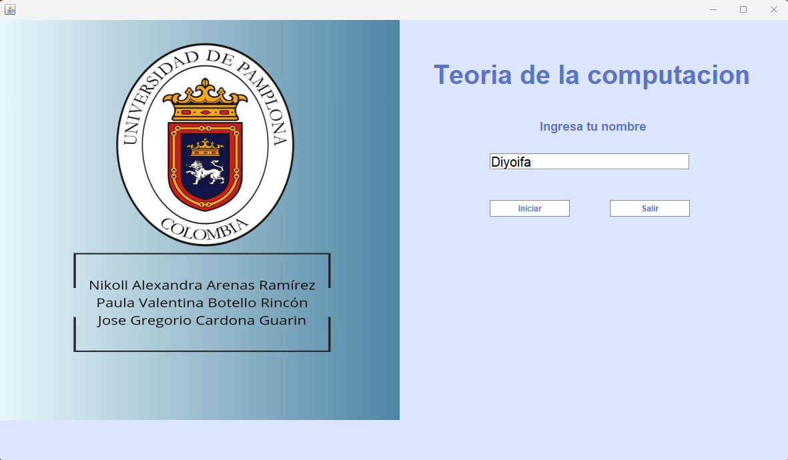
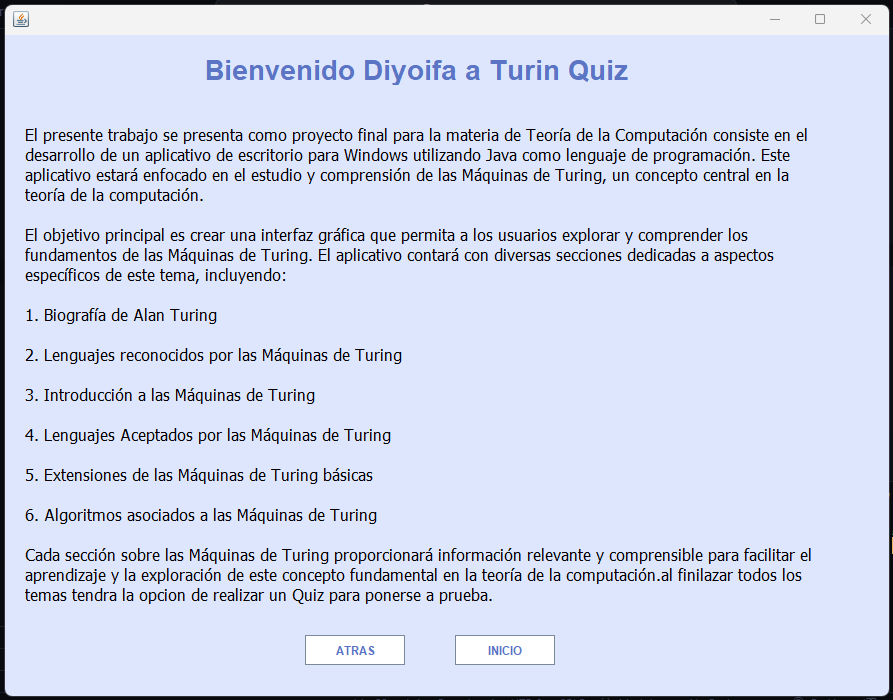
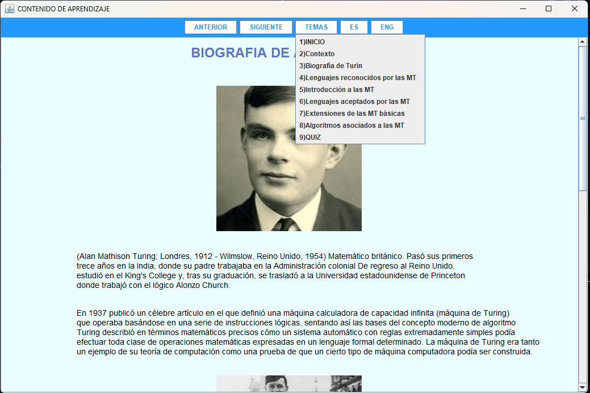
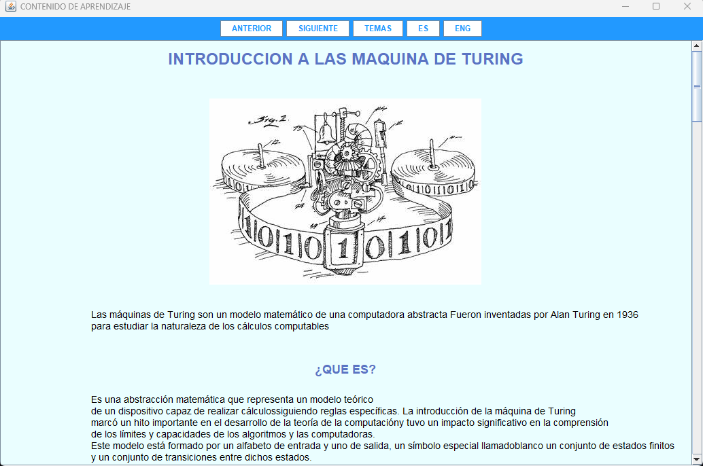

# Turin Quiz 

El presente trabajo se presenta como proyecto final para la materia de Teoría de la Computación consiste en el desarrollo de un aplicativo de escritorio para Windows utilizando Java como lenguaje de programación. Este aplicativo estará enfocado en el estudio y comprensión de las Máquinas de Turing, un concepto central en la teoría de la computación.

El objetivo principal es crear una interfaz gráfica que permita a los usuarios explorar y comprender los fundamentos de las Máquinas de Turing. El aplicativo contará con diversas secciones dedicadas a aspectos específicos de este tema, incluyendo:

## 1. Biografía de Alan Turing

## 2. Lenguajes reconocidos por las Máquinas de Turing

## 3. Introducción a las Máquinas de Turing

## 4. Lenguajes Aceptados por las Máquinas de Turing

## 5. Extensiones de las Máquinas de Turing básicas

## 6. Algoritmos asociados a las Máquinas de Turing

Cada sección sobre las Máquinas de Turing proporcionará información relevante y comprensible para facilitar el aprendizaje y la exploración de este concepto fundamental en la teoría de la computación. y al final se pondra a prueba el aprendizaje mediante un divertido quiz interactivo

# Requisitos funcionales:

## 1.Pantalla  de  inicio,  con  logo  de  la  universidad,  carrera,  nombres  de  estudiantes  y profesor, títulodel  trabajo,  año  (entre otras).  Mínimo  2 botoneso  links*  (iniciar  y salir).

## 2.Pantalla de contexto, donde explican la finalidad del aplicativo.

## 3.Pantalla de menú o contenido, donde se vean los ítems desarrollados ydesde donde se podrá navegar con links al resto del contenido del programa.

## 4.Pantallas de cada tema (6temas): donde se mostrarán conceptos indicados del tema en particular, gráficos, entre otros, alinteractuar con el aplicativo.

## 5.Pantalla  evaluación:  Cuestionario  de  al  menos  5  preguntas  sobre  el  tema  de selección múltiple. Debe dar la calificación al final al darle en un botón calificar.

## 6.Pantalla de salida: al terminar se redireccionará a esta pantalla con breve despedida y conclusión y un link para salir del programa.

## 7. Cada pantalla que lleve conceptos debe permitir cambiar el idioma del concepto de español a inglés y viceversa

# Requisitos no funcionales

## La navegación entre pantallas debe ser limpia y sencilla.

## El contenido debe ser intuitivo y facil de entender.

## La velocidad debe ser optima en cada cambio de pantalla

## El diseño debe ser claro y consistente

# Pantalla de inicio

# Pantalla de contexto 

# Pantallad de Menu

# Mockup de la pantalla del topic
